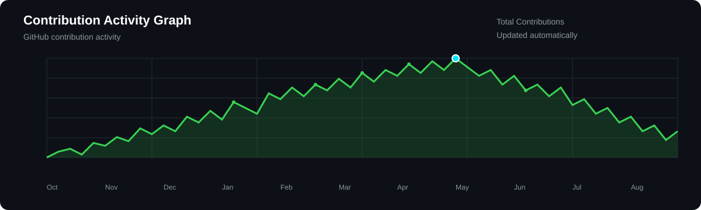

## Hi 👋, I'm Hema Sree

💻 3rd year B.Tech Student
 
🌱 Currently learning Emerging Technologies, Web Development, Core Concepts

🚀 Building Projects

👋 Reach Me : hema24sree0407@gmail.com
<table>
<tr>

<!-- ================= LEFT SIDE ================= -->
<td width="35%" valign="top">

<h2>🌐 Connect With Me</h2>

  

  

  

  

 

### 🚀 Let's Build Something Amazing!

</td>

<!-- ================= RIGHT SIDE ================= -->
<td width="65%" valign="top">

<h2>🛠️ My Skills</h2>

### 💻 Languages

### 🤖 AI / Data & Libraries

### 🗄️ Databases

### ⚙️ Frameworks & Development

### 🔧 Tools & Platforms

### 🎨 Design & Visualization

</td>

</tr>
</table>
## 📈 Contribution Activity

  

---

## 🐍 Contribution Snake

  

